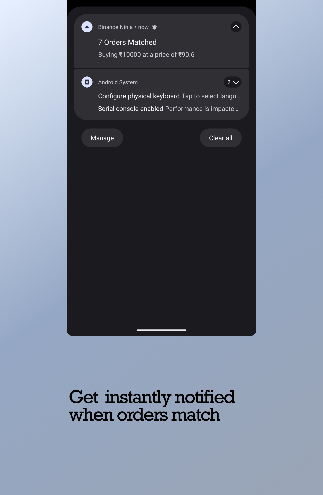
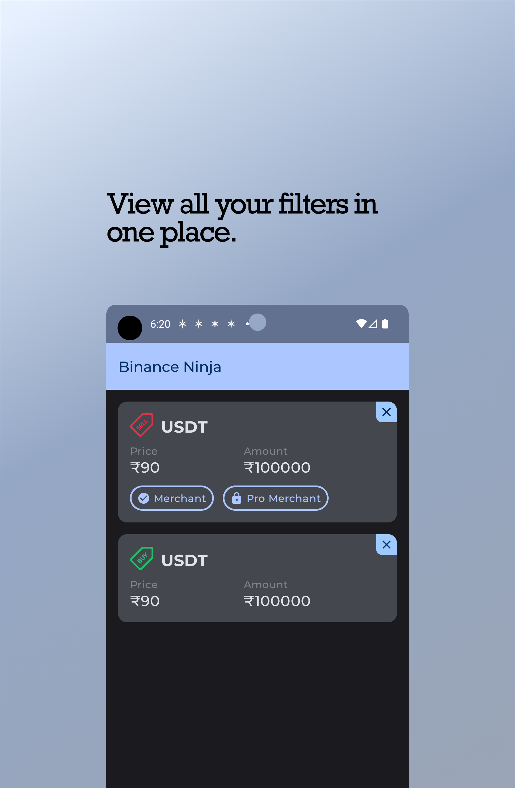

# Binance Ninja

Binance Ninja is a [Kotlin Multiplatform](https://www.jetbrains.com/help/kotlin-multiplatform-dev/get-started.html) project targeting Android, iOS, Desktop. It enables you to
get notifications for P2P orders on Binance.

You can set filters, and It’ll alert you when any order satisfies the filter criteria.

## Download the App

## Screenshots

  
  
  

## Project Configuration 🛠️

* `/composeApp` is for code that will be shared across your Compose Multiplatform applications.
  It contains several subfolders:
    - `commonMain` is for code that’s common for all targets.
    - Other folders are for Kotlin code that will be compiled for only the platform indicated in the
      folder name.
      For example, if you want to use Apple’s CoreCrypto for the iOS part of your Kotlin app,
      `iosMain` would be the right folder for such calls.
    - `/desktopMain` is for Desktop applications.
* `/androidApp` is for Android applications. Even if we're sharing your UI with Compose Multiplatform,
  this is used as the entry point for the Android app.
* `/iosApp` contains iOS applications. Even if you’re sharing your UI with Compose Multiplatform,
  you need this entry point for your iOS app. This is also where you should add SwiftUI code for
  your project.

## Libraries 📚

- [KTOR](/https://ktor.io/docs/http-client-multiplatform.html/)
- [KotlinX](/https://github.com/Kotlin/kotlinx.serialization/) 
- [SQLDelight](https://cashapp.github.io/sqldelight/2.0.0)
- [Napier](https://github.com/AAkira/Napier)
- [Kotlin Inject](/https://github.com/evant/kotlin-inject/)
- [Voyager](https://github.com/adrielcafe/voyager)
- [Compose](https://developer.android.com/jetpack/compose)
- [Notification Desktop](/https://github.com/dorkbox/Notify/)
- [Lyricist](/https://github.com/adrielcafe/lyricist/)

## Credits 🙌

[Twine](https://github.com/msasikanth/twine) served as a good starting point for me.

## TODOs 📝

- Add tests
- ~~Add linter/formatting checks~~
- ~~Add CI/CD~~
+ ~~Add Crypto Selection Feature~~